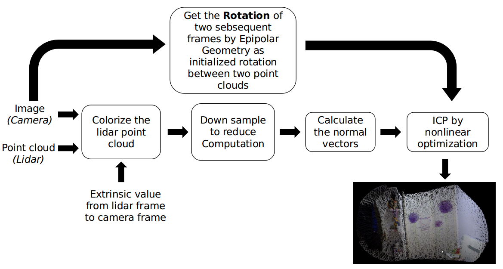

# Colorize the lidar point cloud and mapping

## Content

- [Introduction](#Introduction)
- [Dependence](#Dependence)
- [Usage](#Usage)

## Introduction

In this project, we use a camera and a livox lidar to realize the function of a RGBD camera.

We project the lidar point cloud to the image pixel by pre-known extrinsic calibration value, so as to colorize the lidar point cloud. Then we use a sequence of colorized pointclouds to recover a dense colorful map of an area.

The advantages of this sensor set are longer detection range and better performance in outdoor scenario.

The pipeline of the current version is:

<div align=center></div>

## Dependence

- PCL >= 1.7
- ROS-kinetic
- OpenCV >= 4.2
- Eigen >= 3.4
- ros-keyboard(`/pointcloud_fusion/dependence/ros-keyboard`)

## Usage

### 1. Build the files

1. Build a workspace

```shell
mkdir ws/src
```

2. Clone this repository in `/ws/src`

```shell
cd ws/src
git clone https://github.com/HoEmpire/pointcloud-fusion.git
```

3. Copy the ros-keyboard in '/wsr/src'

```shell
copy -r pointcloud/dependence/ros-keyboard .
```

4. Build the files

```shell
catkin_make
```

### 2. Set the configs

We need to set two config files. The first one is in `/pointcloud_fusion/cfg/config.txt` and the other is in `/pointcloud_fusion/cfg/pointcloud_fusion.yaml`

#### config.txt

```txt
-0.00332734 -0.999773 0.0210511 0.00796863
-0.0123546 -0.0210085 -0.999703 0.0592725
0.999918 -0.00358643 -0.0122819 0.0644411
1211.827006 0.000000 710.858487
0.000000 1209.968892 552.339491
0.000000 0.000000 1.000000
-0.103090 0.109216 0.002118 0.000661 0.000000
0.10
0.0000001
200
```

```txt
Rotation Matrix[3x3] Translation Vector[3x1]
Camera Matrix[3x3]
k1 k2 p1 p2 k3
Maximum Correspondence Distance of ICP
Transformation Epsilon of ICP
number of iterations of ICP
```

#### pointcloud_fusion.yaml

```yaml
pointcloud_fusion:
  lidar_topic: /livox/lidar # subscribed lidar topic
  camera_topic: /camera_array/cam0/image_raw # subscribed camera topic
  save_path: /home/tim/dataset/test2 # save path of the logging mode
```

### 3. Run the code

```shell
roslaunch pointcloud_fusion multi_color_pointcloud
rosrun keyboard keyboard
```

Then press the keyboard in keyboard window to enter different command.

1-adding a new set of colorized pointcloud

2-mapping with all the pointcloud and kill ros after finishing this process

3-save a set of colorized pointcloud in `.pcd` and images in `.jpg` in
`save_path`

4-end logging and generate a description of the datas, then kill ros

Finally after mapping, the code will generate a mapping result in `/home/icp.pcd`. You can view the result by

```
pcl_viewer icp.pcd
```
